MMIO地址映射：

- `0x0100_0000` `MEM`（数据存储器）
- `0x0200_0000` `KBD`（PS2键盘扫描码）
- `0x0300_0000` `VMEM`（字符显存）
- `0x0400_0000` `HEX`（数码管）
- `0x0500_0000` `LEDR`（LED寄存器）
- `0x0600_0000` `SW`（拨码开关）
- `0x0700_0000` `KEY`（按键，当前返回0）
- `0x0800_0000` `CLK`（`+0/+4/+8/+c` 分别为 us/ms/ds/s）
- `0x0900_0000` `VGA_CTRL`（0: 字符模式, 1: 图形模式）
- `0x0a00_0000` `FB`（图形帧缓冲）

## 运行方式

1. 首先将repo中的am_home设置为$MYCPU_AM_HOME环境变量
2. 安装相关工具
   - riscv工具链(与projectN-ICS-PA相同)
   - verilator (version >= v4.204

3. 一键构建并更新上板镜像（在仓库根目录执行）：

```
 # typing-game
 ./abstract-machine/scripts/build_fpga_app.sh 
 ./am_kernel/typing-game
 
 # myterm
 ./abstract-machine/scripts/build_fpga_app.sh 
 ./am_kernel/myterm
 
 # oslab0 某个游戏（示例：tanchishe）
 ./abstract-machine/scripts/build_fpga_app.sh 
 ./am_kernel/oslab0 GAME=tanchishe
```

执行后会自动更新：

- `fpga/Test_8_Instr.dat`（指令镜像）
- `fpga/prog1_word.hex`（数据镜像）

4. vivado

```
reset_run synth_1
reset_run impl_1
launch_runs synth_1 -jobs 8
wait_on_run synth_1
launch_runs impl_1 -to_step write_bitstream -jobs 8
wait_on_run impl_1
```


## 1.五阶段流水线框架搭建

allowin 表示本级流水线是否允许有数据输入;
ready_go 表示本级流水线的当前数据是否准备好了传递给下一级;
pipex_to_pipex_valid 表示流水线传递的数据是否合法

## 2. 添加前递
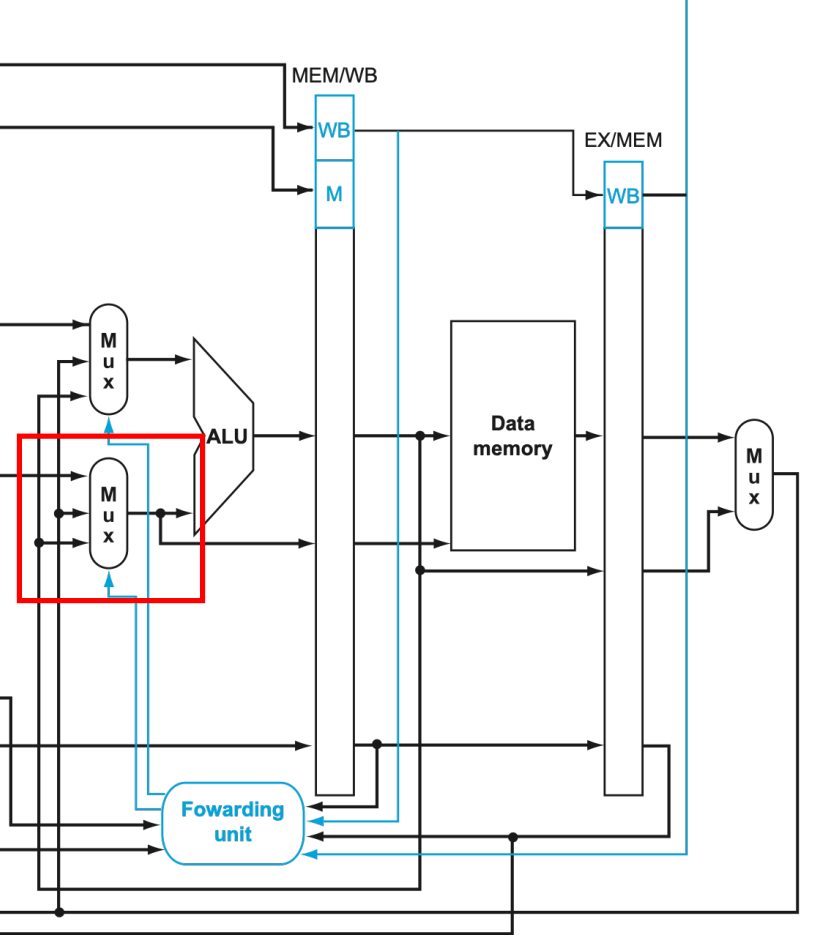
    IF  |   ID  |   EX  |   MEM |   WB  
共有这五个阶段  
可能会从MEM/WB和EX/MEM这两个流水线后前递到ALU处。
### EX/MEM 前递
```verilog
Forwarding Condition: EX/MEM hazard
     if (EX/MEM.RegWrite and (EX/MEM.RegisterRd ≠ 0)
and (EX/MEM.RegisterRd = ID/EX.RegisterRs1)) ForwardA = 01
     if (EX/MEM.RegWrite and (EX/MEM.RegisterRd ≠ 0)
and (EX/MEM.RegisterRd = ID/EX.RegisterRs2)) ForwardB = 01
```
### MEM/WB 前递
```verilog
Forwarding Condition: MEM/WB hazard
     if (MEM/WB.RegWrite and (MEM/WB.RegisterRd ≠ 0)
and not(EX/MEM.RegWrite and (EX/MEM.RegisterRd ≠ 0)
and (EX/MEM.RegisterRd = ID/EX.RegisterRs1))
and (MEM/WB.RegisterRd = ID/EX.RegisterRs1)) ForwardA = 10
     if (MEM/WB.RegWrite and (MEM/WB.RegisterRd ≠ 0)
and not(EX/MEM.RegWrite and (EX/MEM.RegisterRd ≠ 0)
and (EX/MEM.RegisterRd = ID/EX.RegisterRs2))
and (MEM/WB.RegisterRd = ID/EX.RegisterRs2)) ForwardB = 10
```
MEM/WB 要保证没有发生EX/MEM前递，即EX/MEM前递优先处理！

### 实现思路
1. 添加一个Fowarding unit模块，产生控制信号，确定是否有前递情况
2. ALU_A处的mux：一是来自RD1,二是来自前递的两个数据
3. ALU_B处的mux：先要确定数据来自RD2还是immout,在确定是否有前递

所以要在ALU前再添加两个mux，命名为 `Forwarding_A_MUX`和`Forwarding_B_MUX`


## 3.冒险检测+停顿
检测条件
```verilog
ID/EX.MemRead
and ((ID/EX.RegisterRd = IF/ID.RegisterRs1)
or (ID/EX.RegisterRd = IF/ID.RegisterRs2))
```
条件成立，PC_write = 0,IF/ID.write = 0,然后再把ID/EX flush控制信号清零  
插入一个NOP
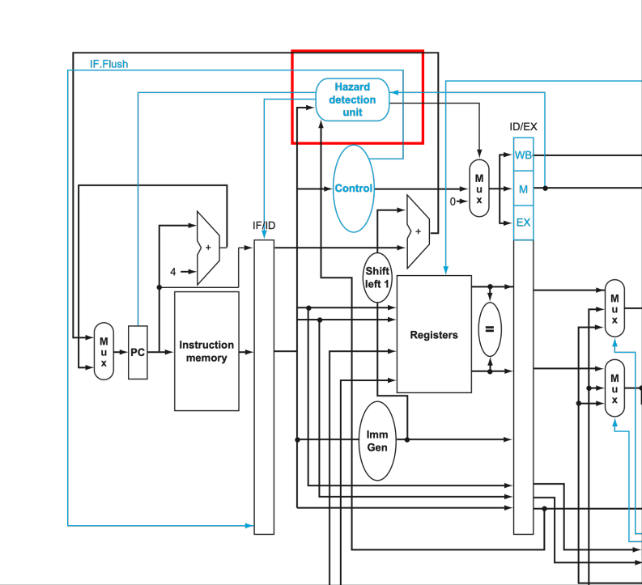

## 4.跳转指令
在NPC模块下添加了一个branch信号输出是否跳转，当跳转成立时，应当flush IF/ID,ID/EX的信号。

## 5.38条指令
待实现的38条指令
• I0={LUI, AUIPC}
• I1={JAL, JALR, BEQ, BNE, BLT, BGE, BLTU, BGEU}
• I2={LB, LH, LW, LBU, LHU, SB, SH, SW}
• I3={ADDI, SLTI, SLTIU, XORI, ORI, ANDI, SRLI,
SRALI, SRAI}
• I4={ADD, SUB, SLL, SLT, SLTU, XOR, SRL, SRA, OR, AND}

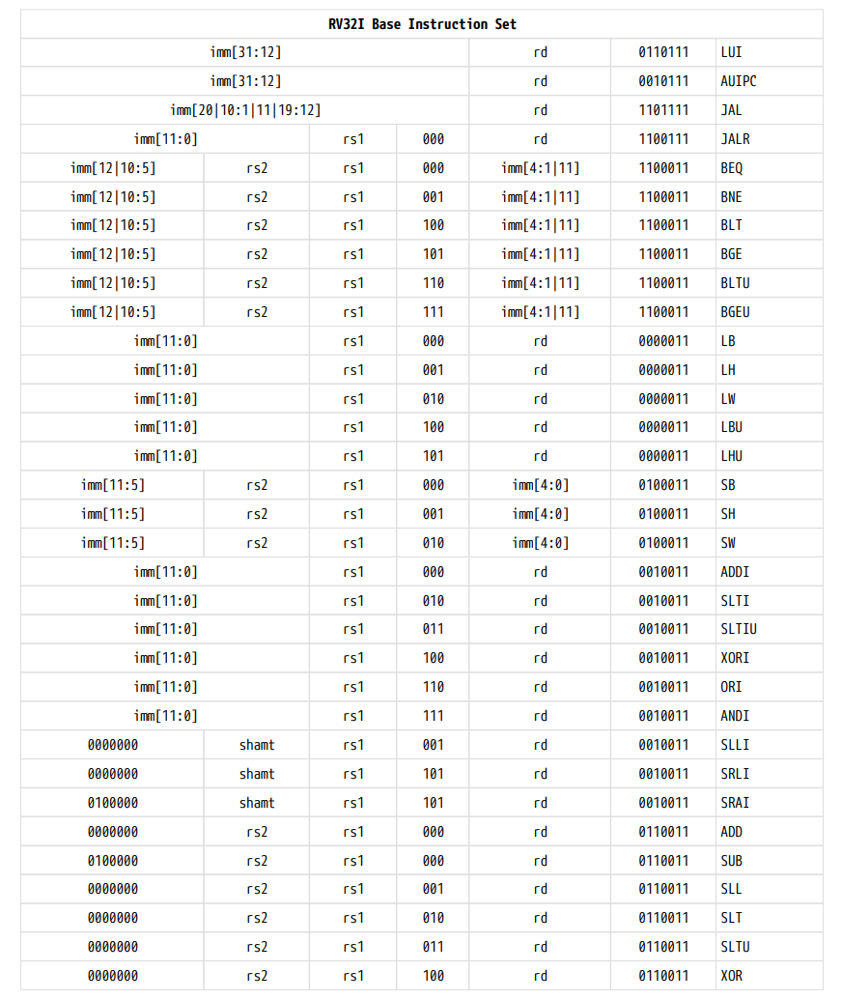
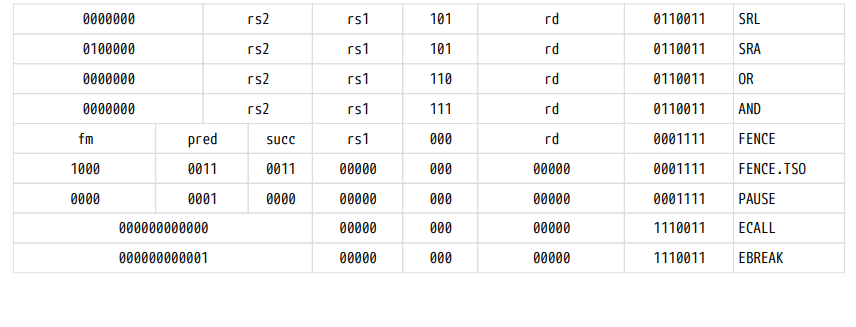

### 5.1 LUI, AUIPC
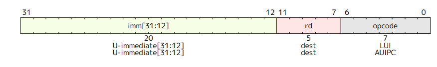
```
LUI (load upper immediate) is used to build 32-bit constants and uses the U-type format. LUI places
the 32-bit U-immediate value into the destination register rd, filling in the lowest 12 bits with zeros.
```
```
AUIPC (add upper immediate to pc) is used to build pc-relative addresses and uses the U-type format.
AUIPC forms a 32-bit offset from the U-immediate, filling in the lowest 12 bits with zeros, adds this
offset to the address of the AUIPC instruction, then places the result in register rd.
```
### 5.2 JAL, JALR, BEQ, BNE, BLT, BGE, BLTU, BGEU
#### 5.2.1 JAL
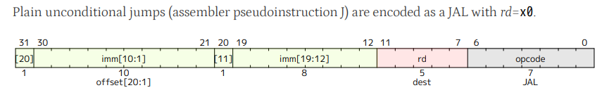
```
The jump and link (JAL) instruction uses the J-type format, where the J-immediate encodes a signed
offset in multiples of 2 bytes. The offset is sign-extended and added to the address of the jump
instruction to form the jump target address. Jumps can therefore target a ±1 MiB range. JAL stores the
address of the instruction following the jump ('pc'+4) into register rd. The standard software calling
convention uses 'x1' as the return address register and 'x5' as an alternate link register
```

#### 5.2.2 JALR
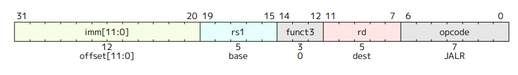
```
The indirect jump instruction JALR (jump and link register) uses the I-type encoding. The target
address is obtained by adding the sign-extended 12-bit I-immediate to the register rs1, then setting the
least-significant bit of the result to zero. The address of the instruction following the jump (pc+4) is
written to register rd. Register x0 can be used as the destination if the result is not required.
```

#### 5.2.3 BEQ, BNE, BLT, BGE, BLTU, BGEU
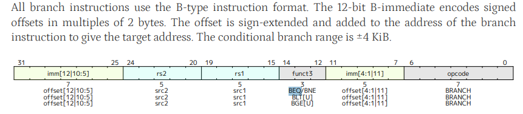

### 5.3 LB, LH, LW, LBU, LHU, SB, SH, SW
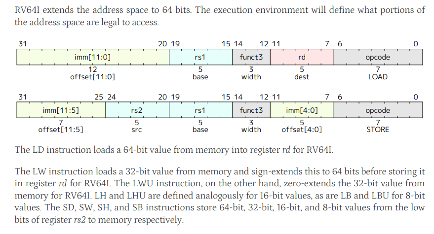

### 5.4 ADDI, SLTI, SLTIU, XORI, ORI, ANDI, SRLI, SRALI, SRAI
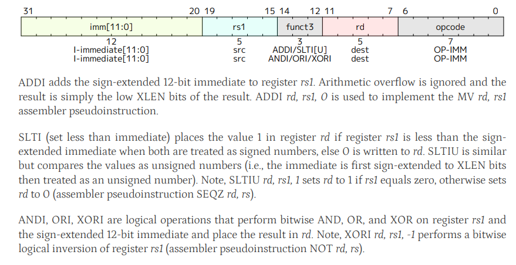
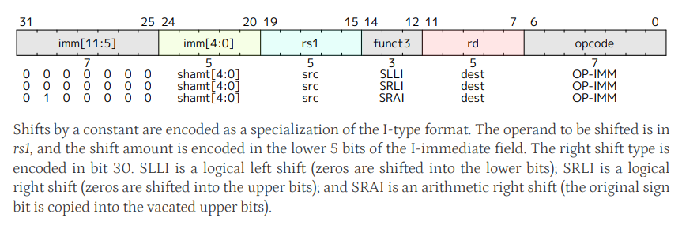

### 5.5 ADD, SUB, SLL, SLT, SLTU, XOR, SRL, SRA, OR, AND
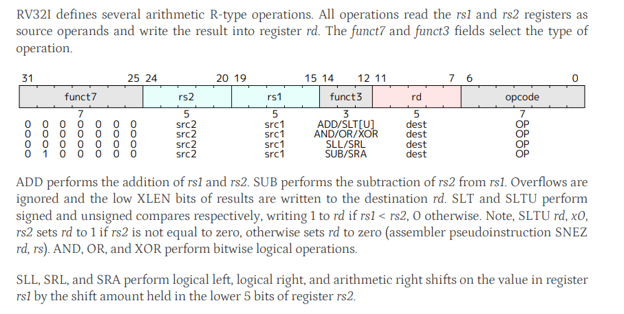
